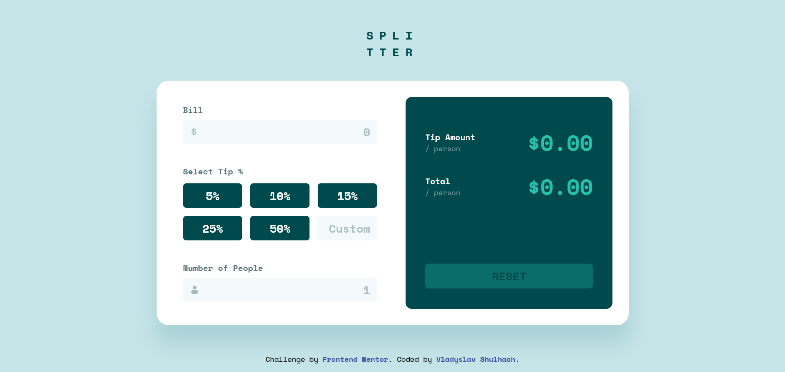

# Frontend Mentor - Tip calculator app solution

This is a solution to the [Tip calculator app challenge on Frontend Mentor](https://www.frontendmentor.io/challenges/tip-calculator-app-ugJNGbJUX). Frontend Mentor challenges help you improve your coding skills by building realistic projects.

## Table of contents

- [Overview](#overview)
  - [The challenge](#the-challenge)
  - [Screenshot](#screenshot)
  - [Links](#links)
- [My process](#my-process)
  - [Built with](#built-with)
  - [What I learned](#what-i-learned)
  - [Continued development](#continued-development)
- [Author](#author)

## Overview

### The challenge

Users should be able to:

- View the optimal layout for the app depending on their device's screen size
- See hover states for all interactive elements on the page
- Calculate the correct tip and total cost of the bill per person
- Test writing incorrect input to see error messages

### Screenshot



### Links

- Solution URL: [Add solution URL here](https://your-solution-url.com)
- Live Site URL: [here](https://tip-calculator-app-main-theta-six.vercel.app/)

## My process

### Built with

- Semantic HTML5 markup
- SCSS (Sass) with BEM and modular structure
- CSS custom properties
- Flexbox
- CSS Grid
- Mobile-first workflow
- Vanilla JavaScript (ES6+)
- Accessibility best practices (aria-live, input validation)

### What I learned

#### Implementing robust and user-friendly numeric input validation in JavaScript

To ensure only valid numbers are entered (e.g., for bill, tip, and people fields), I created a utility function that filters input and prevents invalid characters. This improves both user experience and data integrity.

```javascript
function filterNumericInput(value, allowDecimal = false) {
  let filtered = value.replace(allowDecimal ? /[^0-9.]/g : /[^0-9]/g, "");
  if (allowDecimal) {
    const parts = filtered.split(".");
    if (parts.length > 2) filtered = parts[0] + "." + parts.slice(1).join("");
  }
  return filtered;
}

// Usage in input event:
billInput.addEventListener("input", function () {
  this.value = filterNumericInput(this.value, true);
  // ...other logic...
});
```

#### Improving accessibility with `aria-live` for error messages

To make error messages accessible to screen readers, I added `aria-live="polite"` to error label elements. This ensures that users with assistive technologies are notified of validation errors in real time.

```html
<span class="people__error-label" aria-live="polite"></span>
<span class="bill__invalid-label" aria-live="polite"></span>
```

#### Managing UI state and error feedback for a better user experience

I managed UI state by tracking input values and error states, updating the UI and error messages dynamically. For example, the reset button is only enabled when any field is not at its default value, and error messages are shown or hidden based on validation results.

```javascript
function setResetButtonState() {
  const isBillEmpty = !billInput.value;
  const isTipEmpty =
    !Array.from(tipButtons).some((btn) => btn.classList.contains("active")) &&
    !customTipInput.value;
  const isPeopleEmpty = !peopleInput.value;
  resetButton.disabled = isBillEmpty && isTipEmpty && isPeopleEmpty;
}
```

This approach provides immediate feedback and prevents invalid form submissions, resulting in a smoother and more intuitive user experience.

### Continued development

- Further accessibility improvements (keyboard navigation, focus management)
- More unit tests for input validation logic
- Animations for error messages and UI transitions

## Author

- Frontend Mentor - [Vladyslav Shulhach](https://www.frontendmentor.io/profile/vladyslav-shulhach)
